  

  
  
  
  

## ⚡ Sobre mí

Desarrollador **Full Stack** con base en **.NET y TypeScript**. Construyo productos completos, **de la idea a producción**:
entiendo el problema del negocio, lo traduzco en reglas claras, desarrollo, despliego y mido el resultado.

- 🧩 **Producto de punta a punta.** Relevamiento con el cliente, reglas de negocio, diseño de la solución, desarrollo, deploy y soporte. Hoy tengo proyectos en producción para clientes reales y estoy desarrollando un portal de empleo para un municipio.
- ✅ **Calidad que se puede verificar.** Tests, CI, documentación y decisiones técnicas explícitas: código que otra persona puede entender y mantener.
- 🤖 **IA aplicada al desarrollo.** Integro Claude Code y agentes en mi flujo de trabajo para entregar más rápido sin resignar calidad, y me estoy especializando en **AI Engineering** (LLMs y agentes).
- 🤝 **Abierto a colaborar.** Me sumo a equipos, proyectos colaborativos y code reviews. Me gusta aprender de otros devs y compartir lo que sé.
- 📚 **Aprendizaje constante.** Siempre hay algo nuevo en curso: hoy, Python (CS50P), LLMs y arquitectura de software.

## 🚀 Proyectos destacados

  
  

  
  

  

  
  

## 🛠️ Stack

  <b>Backend</b> 
  
  
  
  
  

  <b>Frontend</b> 
  
  
  
  
  
  

  <b>Datos y cloud</b> 
  
  
  
  
  
  

  <b>IA y herramientas</b> 
  
  
  
  
  

## 📚 Aprendiendo ahora

| | Área | Foco |
|---|---|---|
| 🤖 | **AI Engineering** | LLMs, agentes y RAG aplicados a productos reales |
| 🐍 | **Python** | CS50P (Harvard): base para ML e IA |
| 🏗️ | **Arquitectura** | Clean Architecture, sistemas multi-tenant, seguridad a nivel de base de datos |
| 🇬🇧 | **Inglés** | Lectura técnica diaria y práctica oral |

## 🐍 Actividad

<picture>
  <source media="(prefers-color-scheme: dark)" srcset="https://raw.githubusercontent.com/KevinKener/KevinKener/output/snake-neon-dark.svg">
  <source media="(prefers-color-scheme: light)" srcset="https://raw.githubusercontent.com/KevinKener/KevinKener/output/snake-neon-light.svg">
  
</picture>

---

  

  <b>Rosario, Argentina</b> · Abierto a oportunidades full time y a proyectos colaborativos 
  <a href="https://www.linkedin.com/in/kevinkener07">LinkedIn</a> · <a href="mailto:kevinrkener07@gmail.com">kevinrkener07@gmail.com</a>

